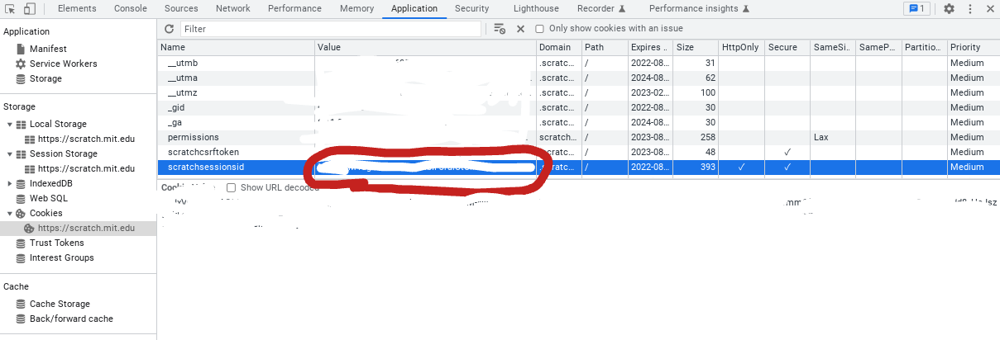

# Usage on Replit

Scratch blocks most requests from the Replit, so you must work around it. To log into Scratch, instead of using your password, you can use your token and session ID.

You can obtain your session ID by [opening your browser developer tools](https://developer.mozilla.org/en-US/docs/Learn/Common_questions/What_are_browser_developer_tools), going to Application > Storage (or just Storage), then finding "scratchsessionsid" and copying the cookie value.



You can obtain your token by running this in your browser console:
```js
alert(
  document.getElementById('app')._reactRootContainer._internalRoot
  .current.child.pendingProps.store.getState()
  .session.session.user.token
);
```

Then copying the value that flashes on your screen.

Then, to log in to scratchclient, use this code:
```python
from scratchclient import ScratchSession

session = ScratchSession("username", session_id="session ID here", token="token here")
```

However, a lot of functionality still might not work. Sites like [Glitch](https://glitch.com/) could serve your purpose in that case- or you can just host it on your own computer.
